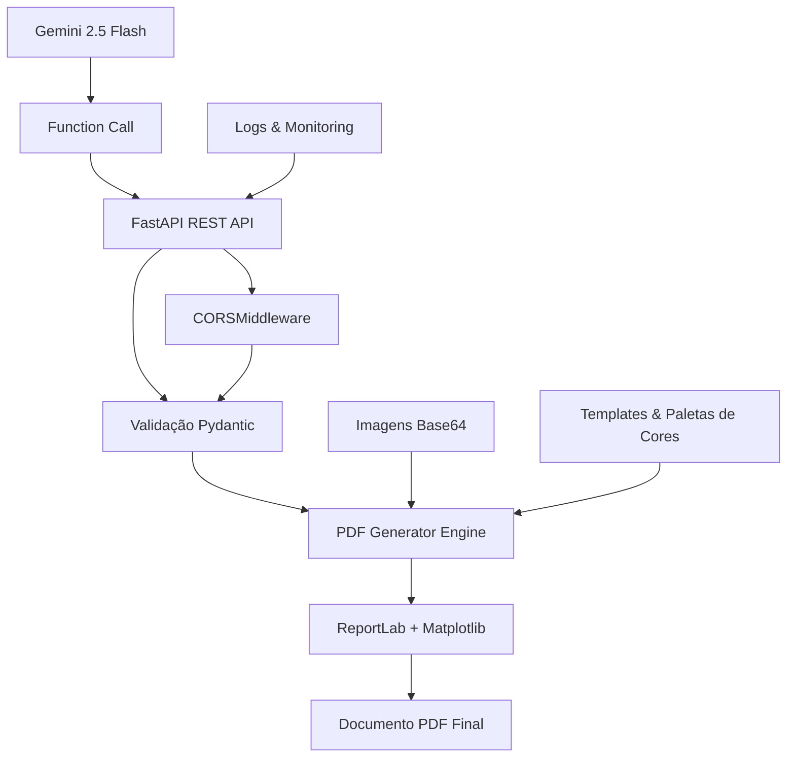

# 🚀 VOXY PDF Generator

> **Sistema Avançado de Geração de Relatórios Técnicos para o Agronegócio**

[](https://fastapi.tiangolo.com/)
[](https://www.python.org/)
[](https://www.docker.com/)
[](LICENSE)

## 📋 Visão Geral

O **VOXY PDF Generator** é uma solução empresarial especializada na geração automatizada de relatórios técnicos profissionais, com foco inicial no **agronegócio brasileiro**. Desenvolvido para **técnicos agrônomos, consultores e profissionais** que realizam visitas técnicas e elaboram relatórios de campo, o sistema combina **Gemini 2.5 Flash** via function calls, processamento avançado de documentos e uma arquitetura robusta para criar documentos de alta qualidade.

### 🎯 Público-Alvo Principal
- **Técnicos Agrônomos** - Relatórios de visitas técnicas e análises
- **Consultores Agropecuários** - Documentos especializados para propriedades rurais
- **Profissionais do Agronegócio** - Relatórios de produtividade, análises zootécnicas
- **Empresas de Assistência Técnica** - Documentação padronizada e profissional

### 🎯 Principais Características

- **🤖 Integração com Gemini 2.5 Flash**: Function calls automáticas para geração de conteúdo estruturado
- **📊 Gráficos Automáticos**: Geração dinâmica de gráficos de barras, pizza e linha
- **🎨 Sistema de Paletas**: 5 paletas de cores profissionais adaptáveis
- **📸 Gestão Inteligente de Imagens**: Inserção por ID com posicionamento flexível
- **🔒 Segurança Empresarial**: Autenticação por API Key e validação robusta
- **🌐 Suporte a CORS**: Integração flexível com frontends
- **🚀 Rate Limiting Ajustável**: Proteção contra sobrecarga por endpoint
- **☁️ Deploy Otimizado**: Para EasyPanel Hostinger (Docker)
- **🔄 Arquitetura Modular**: Preparado para expansão e novos relatórios

## 🏗️ Arquitetura do Sistema



### 🔧 Stack Tecnológico

| Componente | Tecnologia | Versão | Finalidade |
|------------|------------|---------|------------|
| **IA Engine** | Gemini 2.5 Flash | Latest | Geração de conteúdo via function calls |
| **API Framework** | FastAPI | Latest | REST API moderna e rápida |
| **PDF Engine** | ReportLab | Latest | Geração profissional de PDFs |
| **Gráficos** | Matplotlib | Latest | Visualizações e charts |
| **Validação** | Pydantic | Latest | Validação de dados robusta |
| **Servidor** | Uvicorn | Latest | Servidor ASGI de alta performance |
| **Rate Limiting** | SlowAPI | Latest | Proteção contra sobrecarga de requisições |
| **Containerização** | Docker | Latest | Deploy, portabilidade e gestão com EasyPanel |
| **Infraestrutura** | EasyPanel Hostinger | Cloud | Gerenciamento de containers em nuvem |

## 🚀 Instalação e Execução

### Método 1: Docker (Recomendado)

```bash
# Clone o repositório
git clone https://github.com/seu-usuario/voxy-pdf-generator.git
cd voxy-pdf-generator

# **ATENÇÃO (Windows PowerShell):**
# Defina a API_KEY ANTES de rodar o Docker Compose
$env:API_KEY="sua-chave-api-de-teste" ; docker-compose up --build

# **ATENÇÃO (Linux/macOS ou WSL):**
# Defina a API_KEY ANTES de rodar o Docker Compose
# export API_KEY="sua-chave-api-de-teste" && docker-compose up --build

# API disponível em: http://localhost:8000 (ou porta configurada)
```

### Método 2: Instalação Local

```powershell
# Navegue para o diretório do serviço
cd pdf_service

# Instale as dependências
pip install -r requirements.txt

# Execute a aplicação (Windows PowerShell)
$env:API_KEY="sua-chave-api-de-teste" ; uvicorn main:app --reload --host 0.0.0.0 --port 8000

# Ou, para Linux/macOS/WSL
# export API_KEY="sua-chave-api-de-teste" && uvicorn main:app --reload --host 0.0.0.0 --port 8000
```

## 📚 Documentação da API

### 🔍 Endpoints Disponíveis

| Endpoint | Método | Descrição | Autenticação | Rate Limit |
|----------|--------|-----------|--------------|------------|
| `/` | GET | Health check | ❌ | 60/min |
| `/docs` | GET | Documentação Swagger | ❌ | 60/min |
| `/gerar-pdf-dinamico` | POST | Relatórios customizáveis (60/min) | ✅ | 60/min |
| `/gerar-relatorio-visita` | POST | Template Arizona fixo (15/min) | ✅ | 15/min |
| `/gerar-relatorio-adubacao` | POST | Relatório de Adubação (60/min) | ✅ | 60/min |

### 🔐 Autenticação

```bash
curl -X POST "http://localhost:8000/gerar-pdf-dinamico" \
  -H "Authorization: Bearer SUA_CHAVE_API" \
  -H "Content-Type: application/json" \
  -d @exemplo-request.json
```

### 📊 Exemplo de Requisição

```json
{
  "tipo_documento": "Relatório Técnico de Produtividade",
  "titulo_documento": "Análise de Performance - Fazenda Santa Clara",
  "tecnico_nome": "Dr. João Silva - CRMV 12345",
  "paleta_cores": "verde_agronegocio",
  "cliente": "Fazenda Santa Clara",
  "propriedade": "Unidade Produtiva Norte",
  "data_documento": "15/01/2024",
  "conteudo_principal": "## ANÁLISE ZOOTÉCNICA\n\nO rebanho apresentou excelente performance...\n\n[GRAFICO_BARRAS: Produtividade por Lote: Lote A: 1.2, Lote B: 1.4, Lote C: 1.1]\n\n[IMAGEM:0]",
  "recomendacoes": "Recomenda-se ajuste no protocolo nutricional...",
  "conclusoes": "A propriedade demonstra potencial para crescimento...",
  "imagens_anexadas": [
    {
      "id": 0,
      "base64": "iVBORw0KGgoAAAANSUhEUg...",
      "legenda": "Vista geral do rebanho - Lote A"
    }
  ]
}
```

## 🎨 Sistema de Paletas de Cores

O sistema oferece 5 paletas profissionais adaptáveis ao contexto do documento:

| Paleta | Uso Recomendado | Cor Principal | Visualização |
|--------|-----------------|---------------|--------------|
| `azul_escuro` | Relatórios corporativos | #1A365D |  |
| `verde_agronegocio` | Documentos rurais | #1B4332 |  |
| `laranja_comercial` | Propostas comerciais | #C05621 |  |
| `roxo_corporativo` | Documentos executivos | #44337A |  |
| `preto_e_branco` | Documentos minimalistas | #000000 |  (alias `preto_branco`) |

## 🏗️ Arquitetura Refatorada (2024)

### ✅ **Refatoração Completa Realizada**
O sistema passou por uma **refatoração e otimização completa** em setembro de 2025, transformando um arquivo monolítico de 1.196 linhas em uma **arquitetura modular profissional** com **melhorias de segurança e performance**:

| Módulo | Responsabilidade | Linhas Reduzidas |
|--------|------------------|------------------|
| **core/config.py** | Constantes e paletas centralizadas | ~50 |
| **utils/fonts.py** | Gestão de fontes Unicode | ~30 |
| **text/unicode_handler.py** | Correção de caracteres especiais | ~55 |
| **text/html_cleaner.py** | Limpeza e sanitização HTML | ~40 |
| **text/markdown_processor.py** | Conversão Markdown → HTML | ~60 |
| **graphics/chart_factory.py** | Factory de gráficos unificado | ~35 |
| **graphics/charts/** | Gráficos especializados (3 tipos) | ~180 |

### 🎯 **Benefícios Conquistados:**
- ✅ **Single Responsibility** - Cada módulo tem uma função específica
- ✅ **Manutenibilidade** - Código organizado e fácil de localizar
- ✅ **Testabilidade** - Módulos podem ser testados isoladamente
- ✅ **Memory Leak Prevention** - Context managers seguros para matplotlib
- ✅ **Escalabilidade** - Fácil adicionar novos recursos

## 📊 Recursos Avançados

### 🔢 Gráficos Automáticos

O sistema suporta três tipos de gráficos com sintaxe simples:

```markdown
# Gráfico de Barras
[GRAFICO_BARRAS: Título: Item1: 100, Item2: 150, Item3: 120]

# Gráfico de Pizza
[GRAFICO_PIZZA: Distribuição: Categoria A: 40, Categoria B: 35, Categoria C: 25]

# Gráfico de Linha (FORMATO CORRIGIDO)
[GRAFICO_LINHA: Evolução Mensal: Vendas=100,120,140; labels=Jan,Fev,Mar]
```

### 📸 Sistema Inteligente de Imagens

```markdown
# Inserção por ID (controle total de posicionamento)
[IMAGEM:0]  # Primeira imagem enviada
[IMAGEM:1]  # Segunda imagem enviada

# Logo empresarial (exemplo de uso de imagem)
# Para usar a logo, você deve ter a imagem carregada via `imagens_anexadas` no payload
# ou referenciar uma imagem estática usando o caminho correto.
```

### 📋 Tabelas Dinâmicas

```markdown
[TABELA: Relatório de Produtividade
Lote|Animais|GMD (kg/dia)|Conversão
A|45|1.2|6.5
B|38|1.4|6.2
C|52|1.1|6.8]
```

## 🔧 Configuração e Personalização

### 📁 Estrutura de Arquivos (Arquitetura Refatorada)

```
voxy-pdf-generator/
├── pdf_service/              # Core da aplicação REFATORADO
│   ├── main.py              # FastAPI app e endpoints
│   ├── models.py            # Modelos Pydantic
│   ├── pdf_generator.py     # Engine principal (1.077 linhas)
│   ├── core/                # ✅ NOVO - Configurações centrais
│   │   ├── config.py        # Constantes, paletas, limites
│   │   └── exceptions.py    # Exceções customizadas
│   ├── utils/               # ✅ NOVO - Utilitários
│   │   └── fonts.py         # Gestão de fontes Unicode
│   ├── text/                # ✅ NOVO - Processamento de texto
│   │   ├── unicode_handler.py    # Correção caracteres especiais
│   │   ├── html_cleaner.py       # Limpeza HTML
│   │   └── markdown_processor.py # Conversão Markdown → HTML
│   ├── graphics/            # ✅ NOVO - Sistema de gráficos
│   │   ├── matplotlib_utils.py   # Context manager seguro
│   │   ├── chart_factory.py      # Factory de gráficos
│   │   └── charts/              # Gráficos especializados
│   │       ├── bar_chart.py     # Gráficos de barras
│   │       ├── pie_chart.py     # Gráficos de pizza
│   │       └── line_chart.py    # Gráficos de linha
│   ├── requirements.txt     # Dependências
│   └── Dockerfile           # Dockerfile do serviço
├── itens_png_voxy/          # ✅ CORRIGIDO - Assets visuais para templates
│   ├── imagens_arizona/
│   │   ├── arcofinal.png
│   │   ├── legenda.png
│   │   ├── linhavermelha.png
│   │   └── logoprincipal.png
│   └── imagens_dr_pasto/
│       └── logo_drPasto.png
├── docker-compose.yml       # Orquestração Docker
├── function_call_estrutura.json # Exemplo de payload para Gemini
├── prompt_unificado_completo.md # Prompt para Gemini (unificado)
├── voxy_prompt_agro.md     # Prompt especializado (agro)
├── voxy_prompt_arizona.md  # Prompt especializado (Arizona)
├── voxy_prompt_dr_pasto_v2.md # Prompt especializado (Dr. Pasto)
└── README.md               # Esta documentação
```

### 🔐 Variáveis de Ambiente

```bash
# Configuração da API Key (OBRIGATÓRIA)
# Para Windows PowerShell:
$env:API_KEY="sua_chave_secreta_aqui"
# Para Linux/macOS/WSL:
# export API_KEY="sua_chave_secreta_aqui"

# Configurações do servidor (OPCIONAIS - valores padrão já definidos)
# Para Windows PowerShell:
$env:HOST="0.0.0.0"
$env:PORT="8000"
# Para Linux/macOS/WSL:
# export HOST="0.0.0.0"
# export PORT="8000"
```

## 🚀 Deploy em Produção

Para um deploy em produção no EasyPanel Hostinger, siga estes passos críticos:

1.  **Configurar API_KEY:**
    - No painel EasyPanel, vá para as configurações do seu contêiner.
    - Adicione uma nova variável de ambiente com o nome `API_KEY` e defina um valor **secreto e forte**.
    - **NUNCA use chaves de teste ou padrões em produção!**

2.  **Verificar CORS (Cross-Origin Resource Sharing):**
    - Em `pdf_service/main.py`, a configuração atual de CORS está com `allow_origins=["*"]` para facilitar o desenvolvimento.
    - **Para produção, é CRÍTICO que você restrinja esta lista** para incluir APENAS os domínios do seu frontend (ex: `["https://seu-frontend.com.br", "https://outro-dominio.com"]`).
    - Falhar em fazer isso abre uma brecha de segurança para ataques CSRF e outras vulnerabilidades.

3.  **Atualizar Imagem Docker:**
    - Após fazer as alterações de código e documentação, reconstrua sua imagem Docker.
    - No EasyPanel, o processo de deploy geralmente detecta as alterações no `Dockerfile` e `docker-compose.yml` e reconstrói/reinicia o contêiner automaticamente.
    - Verifique sempre os logs do deploy para garantir que não houve erros durante a construção da imagem.

4.  **Monitoramento Ativo:**
    - No EasyPanel, monitore constantemente as métricas de CPU, memória e uso de disco do seu contêiner.
    - Fique atento a picos de uso durante os horários de maior tráfego, especialmente após eventos ou lançamentos.
    - Considere configurar alertas para quando os limites de recursos estiverem próximos de serem atingidos.

### 📈 Considerações de Escalabilidade

- **Recursos do Contêiner:** Se o uso de CPU/memória estiver alto, aumente os limites de recursos do seu contêiner no EasyPanel (lembre-se: `0` significa ilimitado, o que pode ser perigoso se não houver monitoramento).
- **Múltiplas Réplicas:** Para lidar com maior volume de requisições, configure múltiplas réplicas do seu serviço no EasyPanel. O balanceamento de carga será gerenciado automaticamente.
- **Migração para serviços gerenciados:** Para cargas extremas, considere migrar para serviços de contêiner gerenciados (AWS ECS/Fargate, Google Cloud Run) que oferecem escalabilidade automática mais avançada e gerenciamento de infraestrutura.

## 🤖 Integração com Gemini 2.5 Flash

O sistema utiliza **Gemini 2.5 Flash** via **function calls** para gerar conteúdo estruturado automaticamente. A IA processa as informações fornecidas pelos técnicos e gera dados formatados em Markdown, que são então processados pela API para criação do PDF.

### 📋 Prompts Especializados (Atualizados)

| Arquivo | Cliente | Especialidade | Status | Linhas |
|---------|---------|---------------|---------|---------|
| `voxy_prompt_agro.md` | Voxy Agro | Agronegócio geral | ✅ ATUALIZADO | 421 |
| `voxy_prompt_arizona.md` | Arizona Nutrição | Nutrição animal boliviana | ✅ ATUALIZADO | 334 |
| `voxy_prompt_dr_pasto_v2.md` | Dr. Pasto | Consultoria pecuária | ✅ ATUALIZADO | - |
| `prompt_unificado_completo.md` | Universal | Framework escalável | ✅ ATUALIZADO | 162 |

### 🚨 **Correção Crítica Aplicada:**
**Bug gráficos de linha corrigido** em `voxy_prompt_agro.md`:
```markdown
✅ CORRETO: [GRAFICO_LINHA: Título: Serie=val1,val2,val3; labels=label1,label2,label3]
❌ ERRADO:  [GRAFICO_LINHA: Título: Serie1=val1,val2; Meses=Jan,Fev]
```

### 🔄 Fluxo de Function Calls


### 🛠️ Estrutura de Function Args

O sistema utiliza um modelo específico `function_args` para receber dados estruturados do Gemini:

```json
{
  "function_args": {
    "nombre_de_la_hacienda": "Fazenda Santa Clara",
    "propietario": "Sr. João Silva",
    "fecha_de_visita": "15/01/2024",
    "tecnicos_responsables": "Dr. Carlos (Arizona)",
    "contenido_principal": "## ANÁLISE TÉCNICA\n\nConteúdo em Markdown...",
    "proprietario_detalhes": {
      "nome": "Dr. Carlos",
      "formacao": "Médico Veterinário", 
      "cargo": "Técnico Arizona"
    },
    "imagens_anexadas": []
  }
}
```

### ⚙️ Processamento Inteligente

1. **Gemini gera** conteúdo estruturado em Markdown
2. **API processa** e valida os dados
3. **Engine converte** Markdown para PDF profissional
4. **Sistema adiciona** gráficos e imagens automaticamente

## 📈 Monitoramento e Logs

### 📝 Sistema de Logs Implementado

O sistema possui **logging robusto** com diferentes níveis de detalhamento:

```python
# Configuração atual de logging
logging.basicConfig(
    level=logging.INFO,
    format='%(asctime)s - %(levelname)s - %(message)s'
)
```

### 🔍 Tipos de Logs Capturados

| Categoria | Exemplos | Nível |
|-----------|----------|-------|
| **Sucesso** | PDF gerado, gráfico criado, imagem inserida | INFO |
| **Avisos** | Fonte Unicode não encontrada, imagem faltante | WARNING |
| **Erros** | Falha na geração, parse de dados inválido | ERROR |
| **Críticos** | Falhas inesperadas do sistema | CRITICAL |

### 📊 Monitoramento de Processos

**Geração de PDF:**
- ✅ Início e fim de cada geração
- ✅ Nome do documento e propriedade
- ✅ Tempo de processamento

**Processamento de Imagens:**
- ✅ Inserção por ID rastreada
- ✅ Erros de processamento capturados
- ✅ Modo de compatibilidade registrado

**Geração de Gráficos:**
- ✅ Cada gráfico criado é logado
- ✅ Erros de parsing de dados
- ✅ Tipos de gráfico e títulos

### 🚨 Tratamento de Erros Avançado

O sistema captura e trata **21 tipos específicos** de erros:

```python
# Exemplos de erros tratados:
- AttributeError: Dados inválidos (400)
- ValueError: HTML malformado (400) 
- TypeError: Campos não iteráveis (400)
- Parse errors: Gráficos inválidos (logs)
- Image errors: Processamento de imagens (logs)
```

## 🔧 Desenvolvimento e Contribuição

### 🛠️ Setup para Desenvolvimento

```bash
# Clone e configure o ambiente
git clone https://github.com/seu-usuario/voxy-pdf-generator.git
cd voxy-pdf-generator

# Instale em modo desenvolvimento
cd pdf_service
pip install -r requirements.txt
pip install -e .

# Execute os testes
pytest tests/

# Execute com hot-reload
uvicorn main:app --reload
```

### 🧪 Testes

```bash
# Execute todos os testes
pytest

# Testes com cobertura
pytest --cov=pdf_service

# Testes específicos
pytest tests/test_pdf_generation.py
```

## 🚨 Solução de Problemas

### ❌ Problemas Comuns

| Problema | Causa | Solução |
|----------|-------|---------|
| **Erro 403** | API Key inválida | Verifique a variável `API_KEY` |
| **Imagens não aparecem** | IDs incorretos | Verifique a ordem de envio das imagens |
| **PDF malformado** | HTML inválido | Valide o conteúdo Markdown |
| **Timeout** | Documento muito grande | Reduza o número de imagens/gráficos |

### 🔍 Debug Mode

```bash
# Execute com logs detalhados
export LOG_LEVEL=DEBUG
uvicorn main:app --reload --log-level debug
```

## 📞 Suporte e Contato

- **📧 Email**: suporte@voxy.agro
- **🐛 Issues**: [GitHub Issues](https://github.com/seu-usuario/voxy-pdf-generator/issues)
- **📖 Wiki**: [Documentação Completa](https://github.com/seu-usuario/voxy-pdf-generator/wiki)
- **💬 Discord**: [Comunidade Voxy](https://discord.gg/voxy)

## 📄 Licença

Este projeto está licenciado sob a [MIT License](LICENSE) - veja o arquivo LICENSE para detalhes.

## 🏆 Agradecimentos

- **FastAPI**: Framework web moderno e eficiente
- **ReportLab**: Biblioteca robusta para geração de PDFs
- **Matplotlib**: Visualizações de dados profissionais
- **Comunidade Open Source**: Pelas bibliotecas e ferramentas utilizadas

---

<div align="center">

**🚀 Desenvolvido com ❤️ para o Agronegócio Brasileiro**

[](https://github.com/seu-usuario/voxy-pdf-generator)
[](https://github.com/seu-usuario/voxy-pdf-generator/fork)

</div>
